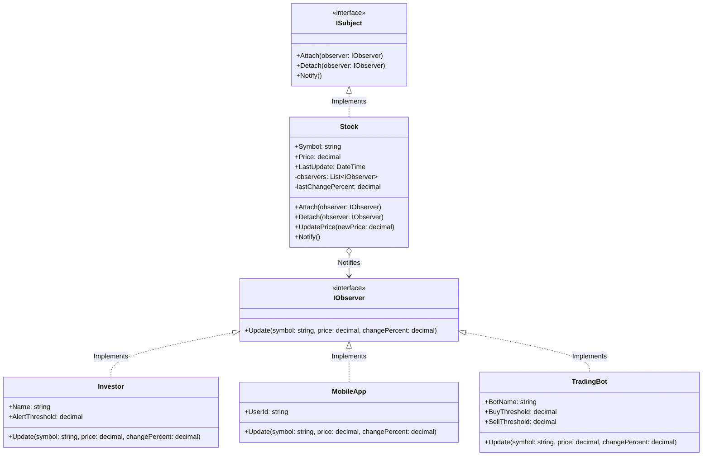

## 🥁 CarnaCode 2026 - Desafio 19 - Observer

Oi, eu sou o Ronaldo e este é o espaço onde compartilho minha jornada de aprendizado durante o desafio **CarnaCode 2026**, realizado pelo [balta.io](https://balta.io). 👻

Aqui você vai encontrar projetos, exercícios e códigos que estou desenvolvendo durante o desafio. O objetivo é colocar a mão na massa, testar ideias e registrar minha evolução no mundo da tecnologia.

### Sobre este desafio
No desafio **Observer** eu tive que resolver um problema real implementando o **Design Pattern** em questão.
Neste processo eu aprendi:
* ✅ Boas Práticas de Software
* ✅ Código Limpo
* ✅ SOLID
* ✅ Design Patterns (Padrões de Projeto)

## Problema
Um sistema financeiro precisa notificar múltiplos investidores quando o preço de ações muda.
O código atual faz polling constante ou tem dependências diretas entre as ações e os investidores, criando acoplamento forte e código difícil de manter.

## Solução (Observer Pattern)
A refatoração consistiu em aplicar o **Observer Pattern** para resolver o problema de forte acoplamento (dependências diretas da classe pai - *Subject* - em relação aos *Observers*) e o problema de desperdício de recursos (*polling*).

### O Padrão Utilizado
O **Observer Pattern** (Padrão Observador) é um padrão de projeto comportamental que define uma dependência um-para-muitos entre objetos. Quando o objeto principal (o "Subject") muda de estado, todos os seus dependentes (os "Observers") são notificados e atualizados automaticamente. 
Isso permite adicionar novos tipos de notificação sem alterar o código primário da Ação, respeitando o Princípio Aberto/Fechado (*Open/Closed Principle* do SOLID).

### Etapas da Refatoração
A refatoração foi realizada de forma iterativa, dividida nas seguintes etapas:
1. **Configuração Inicial**: Criação do projeto .NET 10 (`src/ObserverPattern.csproj`) e configuração do ponto de entrada `Program.cs` para suportar tanto o código legado quanto a nova solução (usando *Reflection* para manter `Challenge.cs` intacto).
2. **Definição de Interfaces**: Criação de `IObserver.cs` e `ISubject.cs` para estabelecer os contratos de comunicação.
3. **Refatoração do Modelo (Subject)**: Implementação da classe `Stock.cs`, que agora mantém uma lista genérica de observadores e dispara notificações através do método `Notify()`.
4. **Refatoração dos Observadores**: Extração e adaptação das classes `Investor.cs`, `MobileApp.cs` e `TradingBot.cs`, fazendo com que implementem a interface `IObserver`.
5. **Integração e Execução**: Ajuste do `Program.cs` para vincular dinamicamente os observadores à ação e exibição do funcionamento no console acompanhado da paralelização do legado.

### Estrutura do Projeto
```text
📦 balta-desafio-carnacode-2026_19-observer
 ┣ 📂 src
 ┃ ┣ 📜 Challenge.cs          # Código original (legado e intacto)
 ┃ ┣ 📜 IObserver.cs          # Interface para os observadores
 ┃ ┣ 📜 ISubject.cs           # Interface para o sujeito (observável)
 ┃ ┣ 📜 Investor.cs           # Observador: Investidor físico
 ┃ ┣ 📜 MobileApp.cs          # Observador: Aplicativo móvel
 ┃ ┣ 📜 ObserverPattern.csproj# Configuração do projeto (.NET 10)
 ┃ ┣ 📜 Program.cs            # Ponto de entrada da aplicação
 ┃ ┣ 📜 Stock.cs              # Sujeito: Ativo financeiro que notifica
 ┃ ┗ 📜 TradingBot.cs         # Observador: Robô de investimentos
 ┣ 📜 .gitignore
 ┗ 📜 README.md
```

### Diagrama de Classes


## Sobre o CarnaCode 2026
O desafio **CarnaCode 2026** consiste em implementar todos os 23 padrões de projeto (Design Patterns) em cenários reais. Durante os 23 desafios desta jornada, os participantes são submetidos ao aprendizado e prática na idetinficação de códigos não escaláveis e na solução de problemas utilizando padrões de mercado.

### eBook - Fundamentos dos Design Patterns
Minha principal fonte de conhecimento durante o desafio foi o eBook gratuito [Fundamentos dos Design Patterns](https://lp.balta.io/ebook-fundamentos-design-patterns).

### Veja meu progresso no desafio
[Repositório central](https://github.com/ronaldofas/balta-desafio-carnacode-2026-central)
